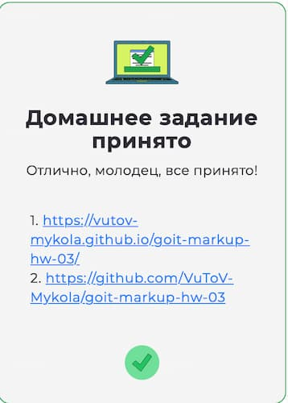

<!-- AUTOGEN:STATS -->
     

## 📸 Latest Screenshot

<!-- END:AUTOGEN -->

## Мої досягнення

 

## Мої сертифікати - Пройшов курс на Sololearn :

[SOLOLEARN](https://www.sololearn.com/certificates/CT-UJ9JRYCU)

## 📌 Завдання

- Створити репозиторій `goit-markup-hw-03`.
- Склонуй створений репозиторій і скопіюй у нього файли попередньої роботи.
- Додай стилі для геометрії (ширину, відступи, поля і рамки) та позиціонування контенту за допомогою **Flexbox** для сторінок макета домашнього завдання #3.
- Налаштуй **GitHub Pages** та додай посилання на живу сторінку у секцію **About**.

---

## ✅ Критерії виконання завдання

### **Проєкт**

- `A1` У корені проєкту є папка `images` з усіма зображеннями.
- `A2` У корені проєкту є папка `css` з файлом стилів.
- `A3` Усі стилі написані в одному файлі `styles.css`.
- `A4` Назви файлів без великих літер, пробілів і трансліту. Лише англійські слова.
- `A5` Код відформатовано за допомогою **Prettier**.
- `A6` Всі зображення та текстовий контент взяті з макета.
- `A7` Підключено нормалізатор стилів [modern-normalize](https://cdnjs.com/libraries/modern-normalize).
- `A8` Код написано з дотриманням гайдів GoIT.

### **Оформлення**

- `B1` Допускається глобальне скидання стилів для `<h1>...<h6>`, `
` і `<ul>`.
- `B2` У елементів відсутні margin, які «пробивають» батьківський блок.
- `B3` Вертикальні відступи між елементами — через `margin`.
- `B4` Проміжки між рамкою батька і дитиною — через `padding`.
- `B5` Розміри margin і padding задані точно за макетом.
- `B6` Створено допоміжний клас `.container` для центрування і обмеження ширини контенту.
- `B8` Ширина контейнера відповідає макету — `1158px`.
- `B9` Контейнер обгортає контент хедера, футера і секцій.
- `B10` Для розташування елементів використовується **Flexbox** лише там, де це необхідно (хедер, навігація, списки тощо).
- `B11` Фінальні розміри блоків у браузері відповідають макету.
- `B12` В елементів відсутня фіксована висота — вона визначається контентом.
- `B13` У хедера є нижня рамка (ледь помітна, як у макеті).
- `B14` Секції розташовані одна під одною без зовнішніх відступів.
- `B15` Для всіх секцій використовується клас `.section` з верхнім і нижнім `padding: 120px`.
- `B16` Для приховування заголовка другої секції використовується патерн `.visually-hidden`.

~~~css
.visually-hidden {
 position: absolute;
 width: 1px;
 height: 1px;
 margin: -1px;
 border: 0;
 padding: 0;
 white-space: nowrap;
 clip-path: inset(100%);
 clip: rect(0 0 0 0);
 overflow: hidden;
}
~~~
- `B16` У картках секції Our Portfolio є рамка (border), але лише знизу.
